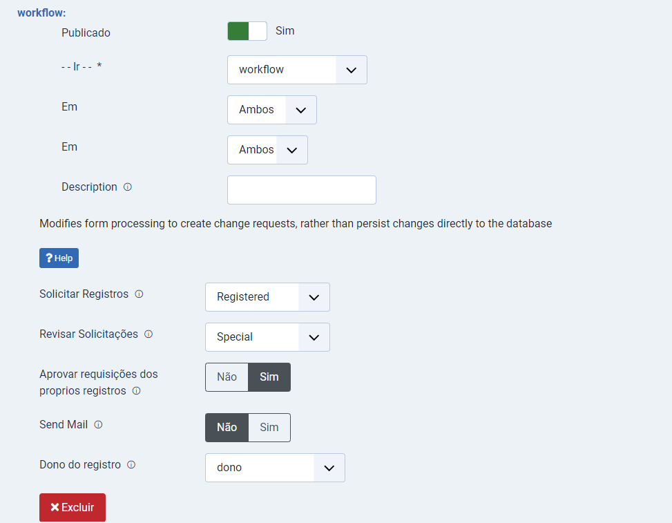
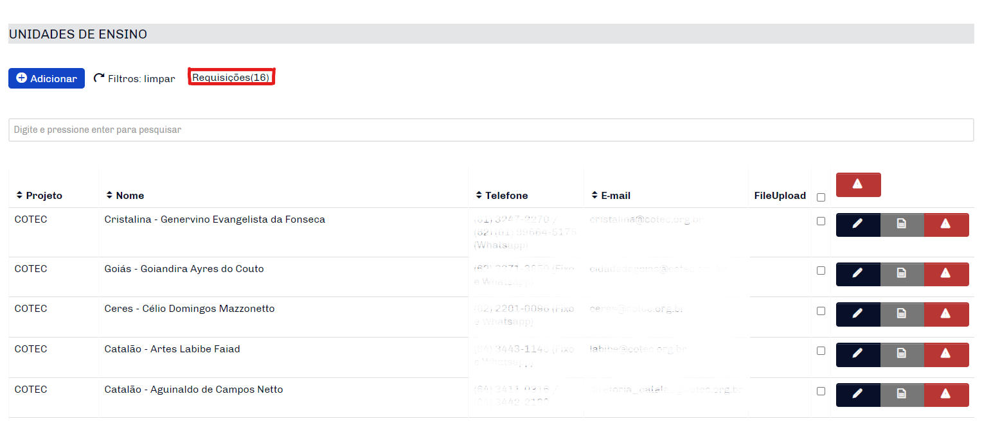
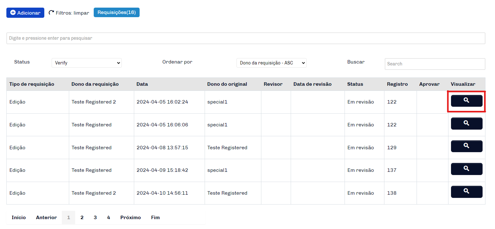
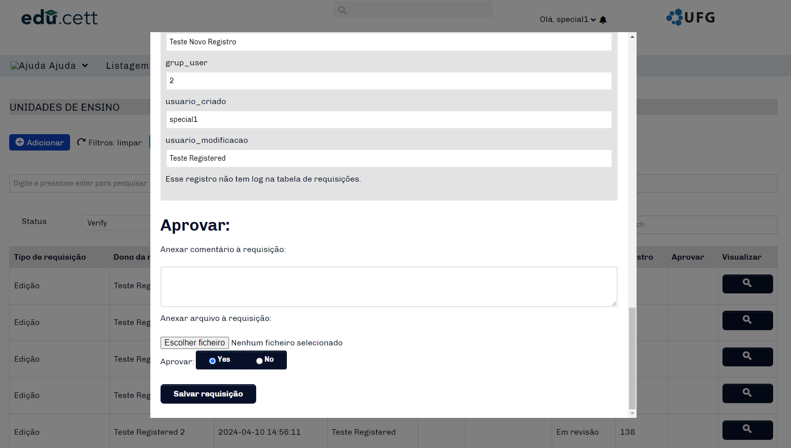
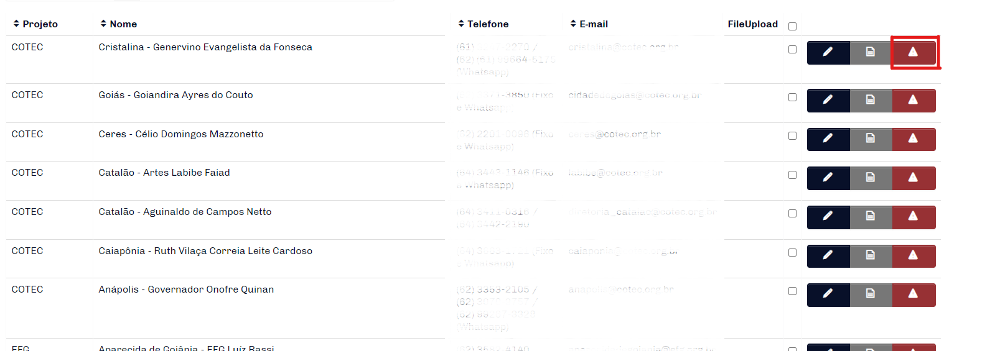

# Fabrik form workflow

This plugin allows users to collaborate with each other on Fabrik lists, you can make a request to add, edit or delete a record. It must be installed together with workflow_request.

### Summary
- [Settings](#settings)
- [Operation](#operation)
- [Report](#report)

### Settings

- `Request Registration`: User Level that can make a request to the list. (Registered by default)
- `Review Request`: User Level that can approve the requests in the list. (Special by default)
- `Approve Requests from Own Record`: When selected yes, the user will be able to freely create a record and approve requests from other users for this record that he or she created. When selected no, record approvals begin only with the user level selected in Review Request.
- `Send Email`: Activates email sending when records are updated.
- `Record Owner`: This is the element that defines the id of the user who owns the record.

### Operation

- `Requisitions`: In the frontend of the list, the number next to Requests represents the number of requests made in the list records. By clicking on the button, a table will be displayed with the details of each request.

- `View`: When clicking on the preview magnifying glass, a modal window will open where you will have all the details of the request. If the user has permission, an option to approve the request or not will be displayed.

      **Note** - Request types can be added, edited or deleted.

- `Save request`: When clicking the Save request button: If Approve to Yes, the fabrik list line will be updated according to the edited data, if Approve to No, the line will not be affected and a log will be created in the #__fabrik_requests table.

### Report

- `Function`: If the user identifies a record with inappropriate content, he or she can make a deletion request by simply clicking the report abuse button. If the user has permission to record it will be deleted, if not, a request will be created and a user with permission must approve it or not.