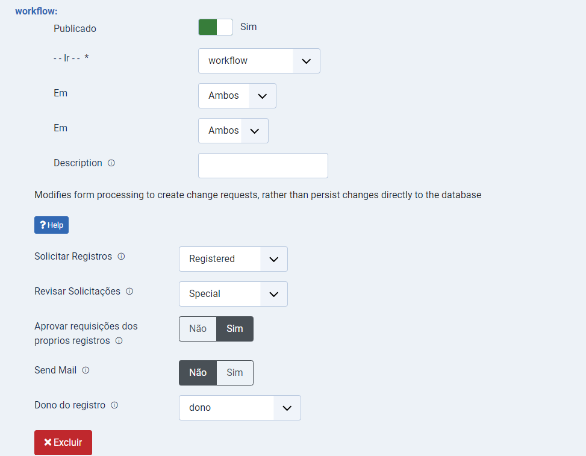
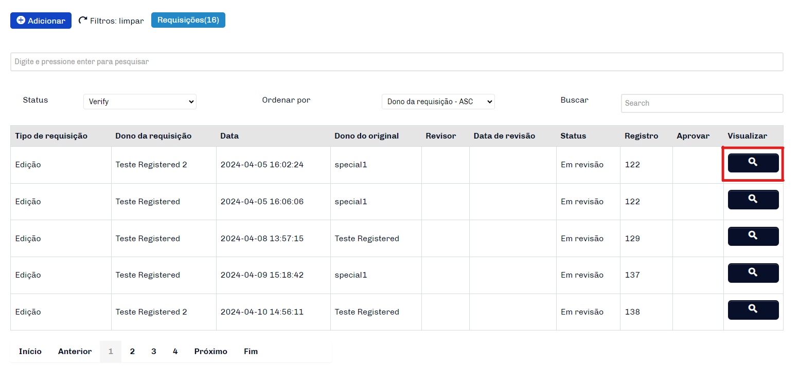

# Fabrik Form Workflow

Este plug-in permite que os usuários colaborem entre si nas listas Fabrik, você pode fazer uma solicitação para adicionar, editar ou excluir um registro. Deve ser instalado juntamente com workflow_request.

### Sumário
- [Configurações](#configurações)
- [Funcionamento](#funcionamento)
- [Reportar](#reportar)

### Configurações

- `Solicitar Registro`: Nível de Usuárioque poderar fazer requisição na lista. (Registered por padrão) 
-  `Revisar Solicitação`: Nível de Usuário que poderá aprovar as requisições na lista. (Special por padrão)
- `Aprovar Requisições do Proprio Registro`:  Quando selecionado sim, o usuário poderá criar livremente um registro e aprovar as requisições de outros usuários para esse registro que ele criou. Quando selecionado não, as aprovações de registros continuam apenas com o nivel de usuário selecionado em Revisar Solicitação.
- `Send Email`:  Ativar envios de emails quando registros forem atualizados.
- `Dono do Registro`:  É o elemento que define o id do usuário dono do registro.

### Funcionamento 

- `Requisições`: No frontend da lista o numero ao lado de Requisões representa a quantidade de requisições feitas nos registros da lista, cliando no botão uma tabela sera exibida com os detalhes de cada requisição.

- `Vizualizar`: Ao clicar na lupa de vizualização será aberto uma janela modal onde terá todos os detalhes da solicitação, caso o usuário tenha permissão será exibido uma opção de aprovar ou não a requisição.

    **Observação** - Os tipos de requisições podem ser Adicionar, Edição ou Deleção.

- `Salvar requisição`: Ao clicar no botão de Salvar requisição: Se Aprovar for Sim a linha da lista fabrik será atualizada de acordo com os dados editados, se aprovar for Não a linha não será afetada e um log será criado na tabela #__fabrik_requests.

### Reportar

- `Função`: Caso o usuário identifique algum registro com conteúdo inadequado podera fazer uma requisições de deleção, bastando apenas clicar no botão de reportar abuso. Se o usuário tiver permissão o registro será excluido, caso não, será criado uma requisição e um usuário com permissão deverá aprovar ou não.
